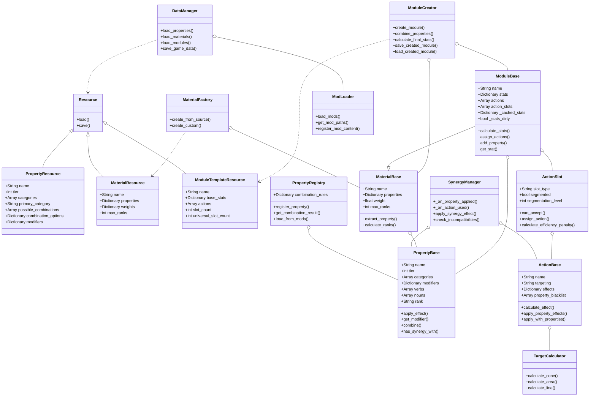

# Component System Implementation Plan

## Overview

This document outlines a phased approach to implementing a modular component system in a Godot 4 game. Instead of a custom TDD framework, we'll use Godot's built-in testing capabilities as needed to verify functionality.

## Godot 4 Testing Approach

We'll leverage Godot 4's built-in testing capabilities:

1. **GUT (Godot Unit Test)**: A third-party plugin that provides a framework for unit testing in Godot
2. **Scene Testing**: Creating test scenes for manual testing of game components
3. **In-Editor Debug Visualizations**: Using Godot's DebugDraw for visualizing systems
4. **Custom Debugging Tools**: Creating in-game panels for inspecting game state

## Directory Structure

```
scripts/
├── components/
│   ├── properties/
│   │   ├── property_base.gd           # Base class for all properties
│   │   ├── property_category.gd       # Enum for property categories
│   │   ├── property_factory.gd        # Factory for creating properties
│   │   ├── property_registry.gd       # Registry for property combinations and modding support
│   │   └── property_synergy.gd        # Handles synergy effects between properties
│   ├── materials/
│   │   ├── material_base.gd           # Base class for materials
│   │   ├── material_factory.gd        # Factory for creating materials
│   │   └── material_data.gd           # Data structure for material properties
│   ├── actions/
│   │   ├── action_base.gd             # Base class for actions
│   │   ├── action_factory.gd          # Factory for creating actions
│   │   └── action_slot.gd             # Class for action slots
│   ├── targeting/
│   │   ├── target_base.gd             # Base class for targeting
│   │   └── target_calculator.gd       # Calculator for targeting logic
│   └── modules/
│       ├── module_base.gd             # Base class for modules
│       ├── module_factory.gd          # Factory for creating modules
│       └── module_creator.gd          # Main logic for module creation
├── autoloads/
│   ├── data_manager.gd                # Singleton for managing game data
│   ├── debug_manager.gd               # Singleton for debug tools
│   ├── synergy_manager.gd             # Singleton for managing property synergies
│   └── mod_loader.gd                  # Singleton for loading mods and custom content
├── ui/
│   ├── crafting/
│   │   ├── module_crafting_ui.gd      # UI for module crafting
│   │   └── property_combination_ui.gd # UI for property combination
│   └── debug/
│       └── debug_panel.gd             # Debug panel for testing
└── test_scenes/                       # Manual test scenes
    ├── property_test.tscn             # Scene for testing properties
    ├── material_test.tscn             # Scene for testing materials
    ├── module_test.tscn               # Scene for testing modules
    └── targeting_test.tscn            # Scene for testing targeting
```

## Implementation Phases

### Phase 1: Core Data Structures & Resource System ✅

**Goal**: Create the foundation for storing and managing game data.

1. **Set up Resource System** ✅
   - Create custom resource types for properties, materials, and modules
   - Implement data loading and saving through Godot's resource system
   - Set up a resource-based serialization system for game data

2. **Create DataManager Singleton** ✅
   - Implement central data access point
   - Add methods for loading game data resources
   - Implement mod loading capabilities

3. **Debug Tools Setup** ✅
   - Create a simple debug panel for inspecting game state
   - Add methods for logging and visualizing data

**Validation**: Create a test scene that loads and displays basic game data. ✅

### Phase 2: Property System ✅

**Goal**: Implement the property system with all tiers and combinations.

1. **Implement Resource-Based Property System** ✅
   - Create a `PropertyResource` class that extends Godot's Resource
   - Define properties for name, tier, categories, modifiers, and combinations:
     - `primary_category`: The main category for simplified mechanics
     - `categories`: All categories the property belongs to
     - `possible_combinations`: An array of arrays, where each inner array contains property names needed to create this property (for T2+)
     - `combination_options`: A dictionary of named combination options, each with properties array and description
       - Format: `{ "option_name": { "properties": ["Prop1", "Prop2"], "description": "Description text" } }`
   - Implement the modding system for properties where each property is defined in its own file:
     - T1 properties in `mods/base_mod/scripts/resources/property_data/tier1/`
     - T2 properties in `mods/base_mod/scripts/resources/property_data/tier2/`
     - T3 properties in `mods/base_mod/scripts/resources/property_data/tier3/`
     - T4 properties in `mods/base_mod/scripts/resources/property_data/tier4/`
   - Update `ModLoader` to discover and load mod properties
   - Update `PropertyRegistry` to register properties from resources and handle named combination options

2. **Implement Property Categories** ✅
   - Create category system with incompatibilities
   - Create system for advanced vs. simplified mechanics:
     - In simplified mechanics, only the primary_category is used for action modifications
     - In advanced mechanics, all categories are considered
   - Implement effect modifiers based on action target types

**Validation**: Create a combined resource test scene that displays properties, allows changing ranks, shows modifiers, and lets users test combinations. ✅

**Example Interaction - Property Synergy**:

**Logical Requirements:**

1. **Signal-Based Communication**
   - Properties need to emit signals when they're applied to targets
   - Properties need to emit signals when they create world effects
   - The synergy system needs to listen for these signals

2. **Multiple Property Processing**
   - The system must process all combinations of properties on a module
   - No property should be considered "primary" or "secondary"
   - All possible category combinations should be checked

3. **Stacking Effects**
   - Some category combinations should stack their effects
   - Each additional property of the same category should enhance the effect
   - Need to track how many times a particular synergy has been applied

4. **Effect Tracking**
   - System must track which effects have already been applied
   - Prevent duplicate application of non-stacking effects
   - Allow stacking where appropriate

5. **Environmental Interactions**
   - World effects need to be registered in a central registry
   - When actions are used, check for nearby world effects
   - Apply synergies between action properties and world effect properties

### Phase 3: Material System ✅

**Goal**: Implement the material system with property storage.

1. **Implement Material Base** ✅
   - Create `MaterialBase` class
   - Add fields for storing properties with their ranks
   - Include properties for name, description, icon_path, material_type, rarity, and source

2. **Implement Material Properties** ✅
   - Materials store properties and their ranks directly (F-SS)
   - Materials have a type (metal, composite, liquid, etc.)
   - Materials have a rarity value (1-5) that is controlled by source logic
   - Materials store source information

3. **Implement Material Resources for Mod System** ✅
   - Create `MaterialResource` template class for defining materials in mod system
   - Set up structure for loading material definitions from mods
   - Create example material definitions

4. **Implement Material Factory** ✅
   - Create factory for generating materials from source data
   - Add methods for custom material creation
   - Create `MaterialDataManager` for loading materials from mod system

**Validation**: Create a test scene that generates materials and displays their properties with ranks. ✅

### Phase 4: Action and Targeting System ✅

**Goal**: Implement the action system with targeting patterns and synergies.

1. **Implement Targeting Framework** ✅
   - Create a TargetingType enumeration with types like single_target, area, cone, line
   - Define specific properties for each targeting type
   - Create a TargetingComponent that serves as the interface for all targeting operations
   - Implement property management for targeting, allowing for base properties and modified properties
   - Add reset functionality to return to base properties after action use

2. **Implement Target Calculator** ✅
   - Create a utility class with methods for calculating targets for each targeting type
   - Implement spatial calculations with optimization in mind
   - Add visualization methods for debugging target areas
   - Support both 2D grid-based and continuous position targeting
   - Implement common helper methods for line-of-sight, penetration, and area calculations

3. **Implement Targeting Testing Framework** ✅
   - Create test scenes to visualize targeting patterns
   - Add debug visualization for target areas, affected tiles, and collisions
   - Implement property display to show current targeting properties
   - Add tools to simulate different environmental conditions

4. **Implement Synergy System** ✅
   - Expand PropertyBase to include targeting-aware modification methods
   - Add methods for detecting and applying synergies between properties
   - Implement category-based synergy detection
   - Create a signal system for property application and action activation
   - Support complex interaction between properties with different categories
   - Implement targeting-specific synergy effects

5. **Implement Action Base** ✅
   - Create `ActionBase` class with common functionality
   - Add methods for effect calculation and application
   - Implement signal emission for synergy processing
   - Add support for effect accumulation and merging
   - Ensure action effects can be modified by properties

**Validation**: Create a test scene that visualizes targeting patterns and action effects with property modifications and synergies.

### Phase 5: Module System

**Goal**: Implement the module system with creation logic.

1. **Implement Module Base** ⬜️
   - Create `ModuleBase` class inheriting from `MaterialBase`
   - Add properties for stats, actions, and slots
   - Implement caching for expensive calculations

2. **Implement Stat Calculation** ⬜️
   - Add logic for calculating stats based on properties
   - Implement modifier compounding
   - Use lazy evaluation to calculate only when needed

3. **Implement Action Modification** ⬜️
   - Add a filtering system for property blacklists
   - Create methods for properties to modify actions based on targeting type
   - Implement effect application pipeline
   - Create a priority system for effect application
   - Support complex effect merging (additive, multiplicative, or replacement)

4. **Implement Action Slots** ⬜️
   - Create `ActionSlot` class
   - Add logic for universal and unique slots
   - Implement slot segmentation system with efficiency penalties
   - Connect action slots to the targeting and synergy systems

5. **Implement Action Assignment** ⬜️
   - Add logic for determining available actions
   - Implement action slot assignment
   - Handle segmentation effects on efficiency

6. **Implement Module Factory** ⬜️
   - Create factory for generating modules from templates
   - Add methods for custom module creation
   - Support loading from resources and mods

**Validation**: Create a test scene that generates modules and displays stats and actions.

### Phase 6: Module Creation System

**Goal**: Implement the complete module creation flow.

1. **Implement Module Creator** ⬜️
   - Create main logic for module creation process
   - Add methods for combining materials and calculating final stats
   - Implement dictionary serialization for player-created modules

2. **Implement Name Generation** ⬜️
   - Add variables to store property verbs and nouns for name generation
   - Set up structure for procedural name generation

3. **Implement Creation UI** ⬜️
   - Create a cascading list of options for testing purposes
   - Add visualization for property combinations and results

**Validation**: Create a test scene that allows complete module creation with UI.

### Phase 7: Integration and Refinement ⬜️

**Goal**: Integrate all systems and refine functionality.

1. **System Integration** ⬜️
   - Connect all components in the game context
   - Implement data persistence using resource-based serialization for game data and dictionary serialization for player creations

2. **Balance and Tuning** ⬜️
   - Adjust property modifiers and weights
   - Fine-tune combination rules and probabilities

3. **Create temp save/caching**
   - Store created game objects in volatile state that resets when game is reset
   - Prepare volatile storage to work with game save system that will be implemented later on

4. **Performance Optimization** ⬜️
   - Profile and optimize critical paths
   - Implement the following optimization strategies:
     - Lazy evaluation for calculations
     - Caching for expensive operations
     - Object pooling for frequently created objects
     - Batch processing for similar operations
     - Asynchronous processing for complex calculations

5. **Polish and Feedback** ⬜️
   - Add visual and audio feedback
   - Implement tooltips and help texts

**Validation**: Create a complete gameplay test scene demonstrating the entire system. ⬜️

## Class Relationships



## SOLID Principles in Implementation

### Single Responsibility Principle
- Each class has a single responsibility:
  - `PropertyBase` handles property behavior
  - `SynergyManager` handles synergy effects between properties
  - `MaterialBase` handles material properties
  - `TargetCalculator` handles targeting calculations
  - `ModuleCreator` handles the module creation process

### Open/Closed Principle
- Systems are open for extension but closed for modification:
  - Property system uses a registry for adding new properties without changing code
  - New targeting patterns can be added to `TargetCalculator`
  - New action effects can be implemented without modifying action base class
  - Mod support allows extending game content without core code changes

### Liskov Substitution Principle
- Child classes can be used wherever parent classes are expected:
  - `ModuleBase` inherits from `MaterialBase` and can be used in its place

### Interface Segregation Principle
- Interfaces are specific to client needs:
  - `PropertyBase` provides only methods needed for property behavior
  - `ActionSlot` has focused methods for slot management

### Dependency Inversion Principle
- High-level modules depend on abstractions:
  - `ModuleCreator` works with `MaterialBase` and `PropertyBase` interfaces
  - Factories create concrete instances but return interface types
  - `SynergyManager` works with signals rather than direct references

## Validation Approach

Instead of formal unit tests, we'll use these validation approaches:

1. **Test Scenes**
   - Create dedicated scenes for testing specific functionality
   - Include UI elements for manipulating parameters and observing results

2. **In-Game Debug Tools**
   - Implement a debug panel for inspecting game state
   - Add visualization tools for targeting and effects

3. **Godot Print Statements**
   - Use strategic print statements during development
   - Implement a logging system for tracking game events

4. **Manual Validation**
   - Create checklists for functionality verification
   - Document expected behavior for key interactions

5. **GUT (Optional)**
   - If needed for complex logic, implement specific GUT tests
   - Focus on critical calculations and algorithms

## Performance Optimization Strategies

1. **Lazy Evaluation**
   - Only calculate property combinations and effects when needed
   - Use dirty flags to track when recalculation is necessary

2. **Caching**
   - Cache results of expensive calculations like stat modifiers
   - Implement a cache invalidation system when properties change

3. **Object Pooling**
   - Reuse objects for frequently created elements like targeting indicators
   - Implement a pool manager for common game objects

4. **Spatial Partitioning**
   - Use spatial data structures for efficient targeting calculations
   - Implement grid-based systems for area effects

5. **Batch Processing**
   - Group similar operations together for efficiency
   - Process property effects in batches rather than individually

6. **Asynchronous Processing**
   - Move complex calculations off the main thread where possible
   - Use Godot's threading capabilities for intensive operations

## Save/Load System

We'll implement a hybrid approach:

1. **Resource-Based Serialization**
   - Use for core game data (property definitions, material templates)
   - Leverage Godot's built-in resource system
   - Implement custom resources that extend Resource class

2. **Dictionary Serialization**
   - Use for player-created content (modules, custom materials)
   - Convert objects to dictionaries and save as JSON
   - Store in user:// directory for persistence

## Development Milestones

1. **Core Data Structure (Week 1)** ✅
   - Complete resource system and data manager
   - Set up mod loading infrastructure

2. **Property System (Week 2-3)** ✅
   - Implement property base class and registry
   - Set up synergy system with signal connections

3. **Material System (Week 3-4)** ✅
   - Implemented core material system classes
   - Extended resource test scene to support material testing with UI
   - Created example material definitions for the mod system

4. **Targeting and Action System (Week 4-5)** ✅
   - Implement targeting patterns and action modification
   - Connect action system to synergy manager

5. **Module System (Week 5-6)**
   - Implement module base with caching
   - Create stat calculation with lazy evaluation

6. **Creation System (Week 6-7)**
   - Implement complete creation flow
   - Set up serialization for created modules

7. **Integration and Polish (Week 8)**
   - Complete system integration
   - Implement performance optimizations

This phased approach allows for incremental development with clear validation points, following SOLID principles throughout the implementation.
